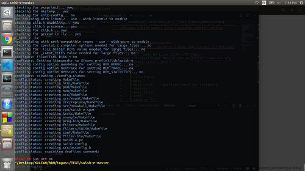
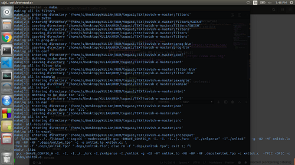
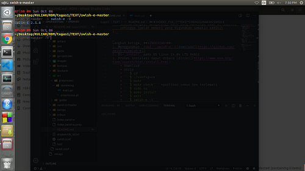
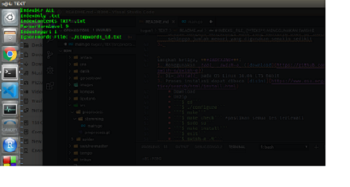
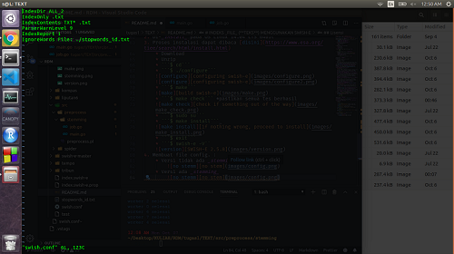
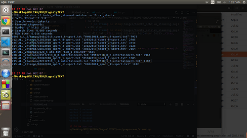

# INDEKS _FILE_ (**TEKS**) MENGGUNAKAN SWISH-E
by: [M. SALSABILA JAMIL](https://github.com/jamilsalsabila)

[SWISH-e](https://www.esa.org/tiee/search/html/index.html) adalah sebuah _tool_ yang digunakan untuk meng-indeks teks dalam berbagai format, seperti PDF, html, txt, XML, PostScript, dll. Selain meng-indeks, _tool_ ini juga dapat mencari dokumen berdasarkan _query_ yang di-_input_-kan. _Tool_ ini memiliki banyak fitur/kemampuan yang dimilikinya, contohnya:
   - Dapat menentukan _stopword list_ yang hendak digunakan
   - Dapat Menentukan direktori (berisi file) yang ingin di-indeks
   - Dapat Menentukan jenis file yang di-indeks (PDF?, XML?, email?, txt?, html?, dll)
   - Bisa melakukan _stemming_ (dalam beberapa bahasa)
   - _Fast_
   - Dapat meng-indeks berita dari suatu _website_ (_crawling_)
   - Dapat Mencari dokumen yang mengandung _query_ yang dimasukkan
   - Dan masih banyak lagi -> [Baca Lebih Lanjut](https://www.esa.org/tiee/search/html/readme.html)

Berikut dijelaskan cara menggunakan _tool_ ini.

Langkah pertama yaitu ***DOWNLOAD FILE*** **BERISI TEKS** (disini penulis menggunakan TEKS BERITA)
1. Penulis membuat skrip untuk mengunduh berita pada website:
    * [KOMPAS](https://www.kompas.com): ```src/spider/spider_kompas.go```
    * [TEMPO](https://www.tempo.co): ```src/spider/spider_tempo.go```
    * [ANTARA](https://www.antaranews.com):
        - ```src/spider/spider_antara.go```
        - ```src/spider/spider_antara_oto.go```
2. Tema-tema berita yang di-_download_:
    * _Entertainment_/Hiburan
    * _Sport_/Olahraga
    * Tekno
    * Otomotif
3. Bagian-bagian _HTML_ yang diambil:
    * _Title_/Judul
    * Tanggal Terbit
    * _Tag_ (Opsional)
    * _Content_/Isi
4. Berita yang terkumpul Dapat dilihat pada _folder_:
    * ```kompas/```
    * ```tempo/```
    * ```antara/```
5. Selanjutnya dilakukan proses ***PREPROCESSING***:
    * Menghapus ```\n\r```
    * Menghapus tanda baca yang dianggap ***TIDAK PENTING**
    * Mengubah _spasi_ lebih dari satu menjadi satu _spasi_
    * _Lowercase every letter_
    * Hasil disimpan pada folder:
        * ```ALL/```
        * Secara keseluruhan berjumlah: ***~55K***

Langkah kedua, ***STEMMING***:  
1. Pengertian:
Mengubah kata ke bentuk dasarnya, contoh:  
    * berjalan -> jalan
    * memancing -> pancing
    * menggunakan -> guna
2. Tujuan:  
    Sebisa mungkin mengurangi kata yang nantinya akan di-indeks, sehingga jumlah memori yang digunakan semakin sedikit
3. Proses _STEMMING_ menggunakan pustaka/modul yang dikembangkan oleh [RadhiFadlillah](https://github.com/RadhiFadlillah/go-sastrawi) dalam bahasa [GO](https://golang.org/), dimana RadhiFadlillah mengambil referensi dari [andylibrian](https://github.com/sastrawi/sastrawi) yang mengembangkannya dalam bahasa PHP.
4. Pustaka  (kopi sebahagian dari [README.md RadhiFadlillah](https://github.com/RadhiFadlillah/go-sastrawi))  
    #### Algoritma
    1. Algoritma Nazief dan Adriani
    2. Asian J. 2007. ___Effective Techniques for Indonesian Text Retrieval___. PhD thesis School of Computer Science and Information Technology RMIT University Australia. ([PDF](http://researchbank.rmit.edu.au/eserv/rmit:6312/Asian.pdf) dan [Amazon](https://www.amazon.com/Effective-Techniques-Indonesian-Text-Retrieval/dp/3639021649))
    3. Arifin, A.Z., I.P.A.K. Mahendra dan H.T. Ciptaningtyas. 2009. ___Enhanced Confix Stripping Stemmer and Ants Algorithm for Classifying News Document in Indonesian Language___, Proceeding of International Conference on Information & Communication Technology and Systems (ICTS). ([PDF](http://personal.its.ac.id/files/pub/2623-agusza-baru%2021%20d%20VIP%20enhanced-confix-stripping-stem.pdf))
    4. A. D. Tahitoe, D. Purwitasari. 2010. ___Implementasi Modifikasi Enhanced Confix Stripping Stemmer Untuk Bahasa Indonesia dengan Metode Corpus Based Stemming___, Institut Teknologi Sepuluh Nopember (ITS) – Surabaya, 60111, Indonesia. ([PDF](http://digilib.its.ac.id/public/ITS-Undergraduate-14255-paperpdf.pdf))
    5. Tambahan aturan _stemming_ dari [kontributor Sastrawi](https://github.com/sastrawi/sastrawi/graphs/contributors).
    #### Kamus Kata Dasar
    Proses stemming oleh Sastrawi sangat bergantung pada kamus kata dasar. Sastrawi menggunakan kamus kata dasar dari [kateglo.com](http://kateglo.com) dengan sedikit perubahan.
    ## Lisensi
    Sebagaimana [Sastrawi](https://github.com/sastrawi/sastrawi) untuk PHP, [Go-Sastrawi](https://github.com/RadhiFadlillah/go-sastrawi) untuk GO, projek ini juga disebarkan dengan lisensi [MIT](http://choosealicense.com/licenses/mit/). Untuk lisensi kamus kata dasar dari Kateglo adalah [CC-BY-NC-SA 3.0](https://github.com/ivanlanin/kateglo#lisensi-isi).
4.  Proses _STEMMING_ dilakukan menggunakan skrip yang terdapat di folder ```src/preprocess/stemming/main.go```
5.  Cuplikan ketika proses _STEMMING_ berlangsung:
    
6.  Hasil _STEMMING_ ditaruh di folder:  
    - ```ALL_2/kompas```
    - ```ALL_2/tempo```
    - ```ALL_2/antara```

Langkah ketiga, ***INDEXING***:
1. Menggunakan _tool_ _swish-e_ ([download](https://github.com/swish-e/swish-e))
2. Di-_install_ pada OS Linux 16.04 LTS 64bit
3. Proses instalasi dapat dibaca [disini](https://www.esa.org/tiee/search/html/install.html)
    * Download
    * Unzip
    * ```$ cd```
    * ```$ ./configure```
    
    * ```$ make```
    
    * ```$ make check``` *pastikan semua tes berhasil
    
    * ```$ sudo su```
    * ```$ make install```
    
    * ```$ exit```
    * ```$ swish-e -V```
    SWISH-E 2.5.8
    
4. Membuat file config. : **[BACA LEBIH LANJUT](https://www.esa.org/tiee/search/html/swish-config.html)**
    * Versi tidak ada _stemming_
        
    * Versi ada _stemming_
        
5. Konfigurasi proses peng-indeks-an tercantum dalam _file_ config yang telah dibuat: ***swish.conf***.
   *Perlu diperhatikan adanya pemangkasan kata umum (_common words_)(_stopwords_) menggunakan data _stopwords_ bahasa indonesia (**stopwords_id.txt**) yang dapat di-_download_ melalui link [ini](https://docs.google.com/viewer?a=v&pid=sites&srcid=ZGVmYXVsdGRvbWFpbnxrZXZpbmJvdWdlfGd4OjI4ZWY0ZGVkMzJjM2FkYWU). Data _Stopwords_ ini didapat pada _website_ [sites.google.com/site/kevinbouge/stopwords-lists](https://sites.google.com/site/kevinbouge/stopwords-lists).
    * no stem
        
    * with stem
        
6. Dapat dilihat _file_ yang diindeks berjumlah **56295** _files_
7. Waktu peng-indeks-an: **~10 menit**
8. Jumlah _Unique words_:
    * no stem: **~186K**
    * with stem: **~162K**
9. Terlihat perbedaan mencolok antara ***no stem*** dan ***with stem*** dalam hal jumlah _Unique words_
10. Uji Coba _search_ sebuah kata:
    * no stem
        
    * with stem
        
11. Jika ingin mencari dokumen dengan jumlah kata lebih dari satu, maka gunakan tanda petik dua ("[query]"), contohnya ```swish-e -f [index.swish-e] -m 10 -w "jakarta bandung surabaya"```. _Query_ tersebut akan mencari dokumen yang mengandung kata **jakarta AND bandung AND surabaya**. Jika dalam _query_ tersebut ada kata yang terdapat dalam daftar _stopword_, maka akan dihapus/dilewatkan/tidak di proses. Argument dari parameter ```-f``` adalah nama file hasil _indexing_ (_default_: ```index.swish-e```).
12. Arti dari Output (format):
    * Kolom-1: Ranking
    * Kolom-2: Lokasi dokumen/_file_
    * Kolom-3: Judul/Nama dokumen/_file_
    * Kolom-4: _Size_/Ukuran dokumen (dalam _bytes_)
    **[BACA LEBIH LANJUT](https://www.esa.org/tiee/search/html/swish-config.html)**

## ---Download---
Semua file yang digunakan dalam projek ini dapat di unduh pada link berikut
    [UNDUH FILE](https://drive.google.com/open?id=1e0Qtx1KgmzGm3IJGxHW3qBkp9F3BToBb)
